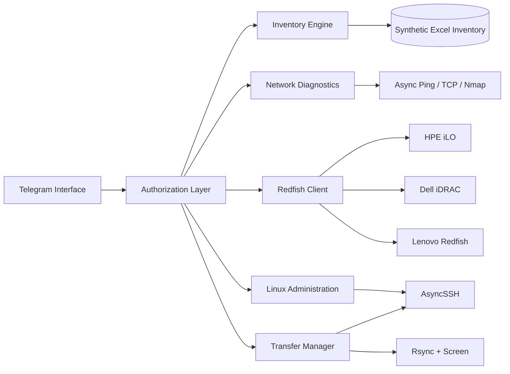

# Infrastructure Automation & Server Management Bot

A portfolio-safe refactor of a real Python infrastructure automation tool originally built to reduce repetitive system-administration and data-center operations through Telegram.

The project combines **inventory intelligence, asynchronous network diagnostics, Linux administration, Redfish hardware management, and server-to-server data transfer orchestration** in one controlled interface.

> **Public-repository safety:** the repository contains no production inventory, private IP inventory, company credentials, Telegram tokens, or hardcoded server passwords. Mutating operations are disabled by default with `SAFE_MODE=true`.

## Why this project exists

Infrastructure teams often repeat the same operational tasks manually:

- Find a server from an Excel-based rack/IP inventory.
- Correlate a production IP with its iLO/iDRAC/BMC address, rack and switch port.
- Check unused or unreachable addresses across a subnet.
- Inspect HPE, Dell and Lenovo hardware through Redfish.
- Update Linux network settings across CentOS and Ubuntu systems.
- Move large amounts of data between Linux servers while monitoring progress.
- Keep a small set of administrative actions available remotely without exposing them to every user.

This project automates those workflows while keeping authorization and safety controls explicit.

## Architecture



## Main capabilities

### 1. Excel inventory intelligence

- Loads every worksheet from an Excel inventory.
- Normalizes inconsistent headings and text formatting.
- Forward-fills Tag, Rack/Unit and Notes fields commonly represented by merged cells.
- Searches different logical column groups with `u`, `s` and `b` commands.
- Correlates a server/network row with a nearby iLO/iDRAC/BMC management row.
- Extracts tag, rack/unit, switch/port, network IPs and notes from the paired context.
- Supports automatic workbook reload through `watchdog`.

### 2. Network diagnostics

- Cross-platform asynchronous ping.
- Concurrent IPv4 subnet checks.
- TCP/22 validation.
- Detection of addresses that appear only inside slash-separated inventory ranges.
- Safe `nmap` execution with validated targets and no shell interpolation.
- SSH banner verification instead of assuming every open port is SSH.

### 3. Server-to-server transfer automation

- AsyncSSH connection management with retry logic.
- Rsync orchestration for `/home` workloads.
- Dynamic timeout calculation based on transfer size and configured bandwidth.
- Concurrent transfer workers.
- `screen` sessions for long-running transfers.
- Transfer/status reporting.
- Source-to-destination SSH key setup without embedding destination passwords in an rsync process command.

### 4. Linux administration

Administrative mutations are blocked while `SAFE_MODE=true`.

Supported workflows include:

- CentOS primary and secondary IP management.
- CentOS secondary-IP replacement.
- CentOS 8 vault repository migration.
- CentOS Stream 9 repository refresh.
- Ubuntu primary/secondary IP operations.
- Ubuntu IP replacement/removal.
- Preventing cloud-init from overwriting network configuration.
- Controlled Linux host bootstrap using credentials supplied through environment variables.

### 5. Redfish hardware management

- HPE iLO, Dell iDRAC and Lenovo-compatible Redfish queries.
- System model, serial number and power state.
- CPU and memory discovery.
- Standard Redfish storage enumeration with SmartStorage fallback.
- Password rotation using caller-configured candidate credentials.
- Standard Redfish account creation/update.

No production/default passwords are included in source code.

### 6. Telegram access controls

- Admin IDs and authorized IDs come from environment variables.
- Runtime whitelist is stored outside source control.
- Admin-only controls for sensitive operations.
- `SAFE_MODE=true` blocks server/network/password changes.
- `ALLOW_CHAT_CREDENTIALS=false` prevents passwords from being supplied through Telegram messages by default.
- Log viewing performs basic secret redaction.

## Repository structure

```text
.
├── .github/workflows/ci.yml
├── docs/
│   ├── FEATURE_MAP.md
│   └── SECURITY_REFACTOR.md
├── sample_data/
│   └── sample_inventory.xlsx
├── src/infra_bot/
│   ├── auth.py
│   ├── config.py
│   ├── inventory.py
│   ├── linux_admin.py
│   ├── network.py
│   ├── redfish.py
│   ├── ssh_client.py
│   ├── telegram_app.py
│   └── transfer.py
├── tests/
├── .env.example
├── .gitignore
├── main.py
├── pyproject.toml
├── requirements.txt
├── SECURITY.md
└── README.md
```

## Quick start

### 1. Create a virtual environment

```bash
python -m venv .venv
```

Linux/macOS:

```bash
source .venv/bin/activate
```

Windows PowerShell:

```powershell
.venv\Scripts\Activate.ps1
```

### 2. Install dependencies

```bash
pip install -r requirements.txt
```

`nmap`, `rsync` and `screen` are external operating-system tools used by the corresponding features.

### 3. Configure the environment

Copy the example configuration:

```bash
cp .env.example .env
```

Load the variables through your preferred environment manager. **Never commit `.env`.**

Minimum configuration for Telegram:

```dotenv
TELEGRAM_BOT_TOKEN=replace_me
ADMIN_USER_IDS=123456789
AUTHORIZED_USER_IDS=123456789
INVENTORY_FILE=sample_data/sample_inventory.xlsx
SAFE_MODE=true
```

### 4. Verify the inventory engine without Telegram

A recruiter or reviewer can test the core inventory logic without a bot token:

```bash
PYTHONPATH=src python -m infra_bot.demo s 192.0.2.10
```

Expected output includes the synthetic asset tag, rack/unit, switch port and paired network IPs.

### 5. Run the Telegram bot

```bash
PYTHONPATH=src python main.py
```

`main.py` automatically loads a local `.env` file through `python-dotenv` when present.

## Demo inventory

`sample_data/sample_inventory.xlsx` contains only synthetic RFC 5737 TEST-NET addresses:

- `192.0.2.0/24`
- `198.51.100.0/24`
- `203.0.113.0/24`

The workbook intentionally includes paired management/server rows and blank cells so the inventory loader can demonstrate the same forward-fill and pairing behavior without exposing private infrastructure data.

Example search:

```text
s 192.0.2.10
```

The inventory engine can correlate that management IP with the associated server row and return its tag, rack/unit, switch/port and network IPs.

## Safety model

The default public/demo configuration is intentionally restrictive:

```dotenv
SAFE_MODE=true
ALLOW_CHAT_CREDENTIALS=false
REDFISH_VERIFY_TLS=true
```

To execute an administrative mutation in an authorized lab/production environment, an operator must deliberately change the relevant configuration. This avoids turning a portfolio clone into an accidentally destructive tool.

See [SECURITY.md](SECURITY.md) and [docs/SECURITY_REFACTOR.md](docs/SECURITY_REFACTOR.md).

## Testing

```bash
pip install -r requirements-dev.txt
pytest
```

The CI workflow runs compilation, tests and a simple secret-pattern scan on every push.

## Technologies

- Python 3.11+
- `python-telegram-bot`
- `asyncio`
- `asyncssh`
- `pandas` / `openpyxl`
- Redfish REST APIs
- `requests`
- `watchdog`
- `python-dotenv`
- Rsync
- Nmap
- Linux networking tools / Netplan / NetworkManager

## Portfolio note

This repository is a sanitized engineering version of a tool developed to automate real infrastructure operations. Production data and credentials were intentionally excluded, while the architectural and operational concepts were retained for technical verification.
